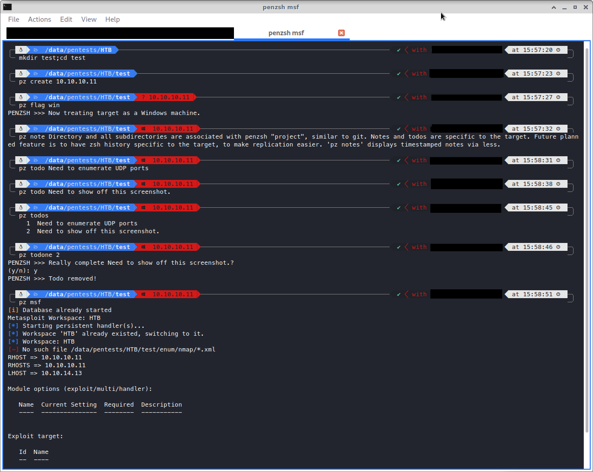

# penzsh
Pentesting Framework for Oh-My-Zsh/PowerLevel10K

## Installation
For Oh My Zsh, git clone into $ZSH_CUSTOM/plugins/penzsh

Add 'penzsh' to the list of plugins in ~/.zshrc

Add 'penzsh' to your POWERLEVEL9K_LEFT_PROMPT_ELEMENTS (or RIGHT) in ~/.p10k.zsh

## Custom Usage
For your own custom commands, place them in the ./custcmds folder. The commands in ./cmds should provide enough information to write your own, for those inclined for scripting. Where a conflict in name exists between a command in ./custcmds and ./cmds, the one in ./custcmds will be used.

## Features
   - Create git-like "penzsh projects" with a particular target; git-like because all sub-directories are part of the penzsh project.
   - zsh history files unique to each project, so you can go back to a target after a month and see what you last did.
   - Notes/todos unique to each project

## Caveat Emptor
This project is still very new and n00b. No guarantees, etc. In particular, the only target testing so far is for valid IPv4 addresses. It hasn't been tested on different machines. Expect things to break?

Also it is super insecure with how it does things, which is a bit ironic...

## Be Good, Do Good
Don't use this for malicious hacking, only wholesome pentesting. :)
